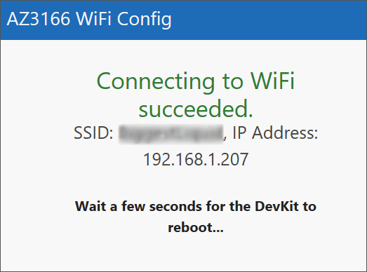
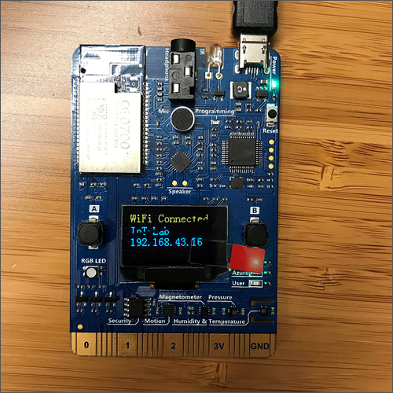
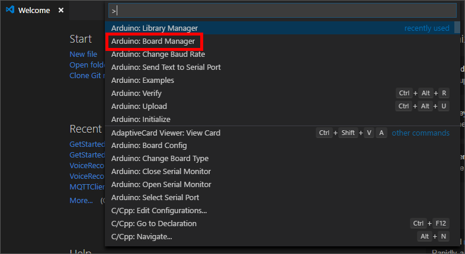
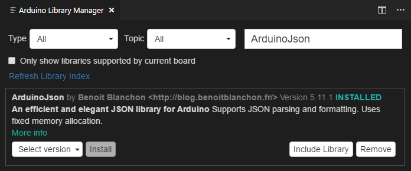
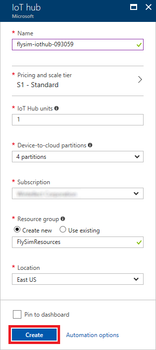
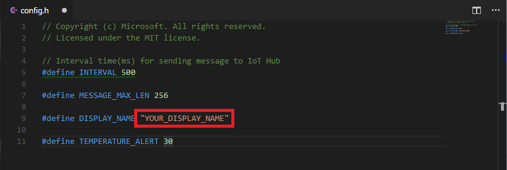
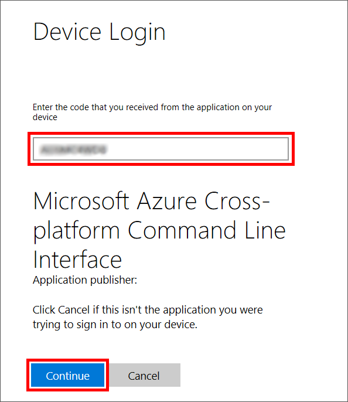
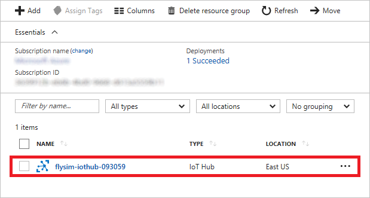
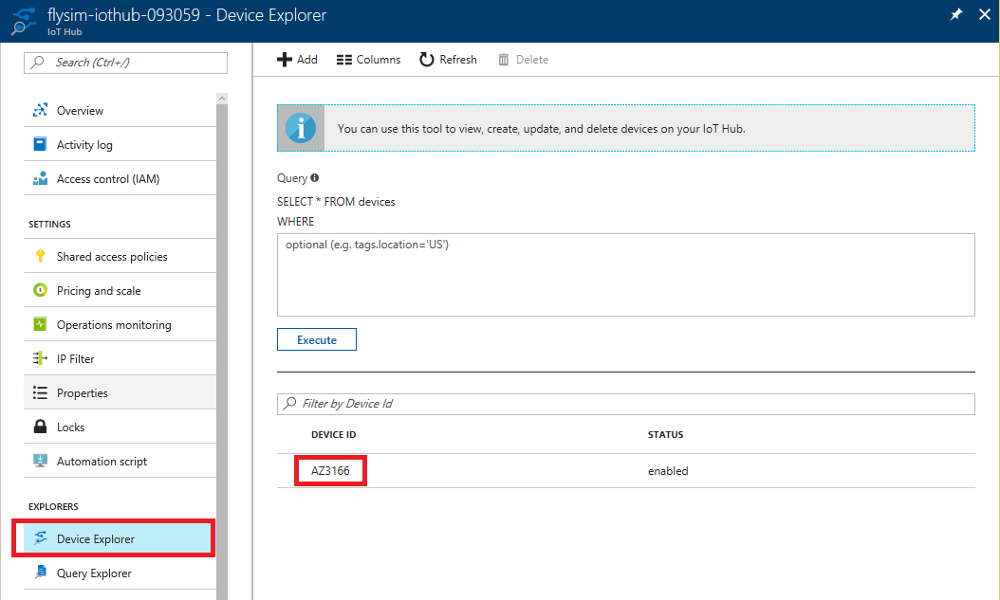
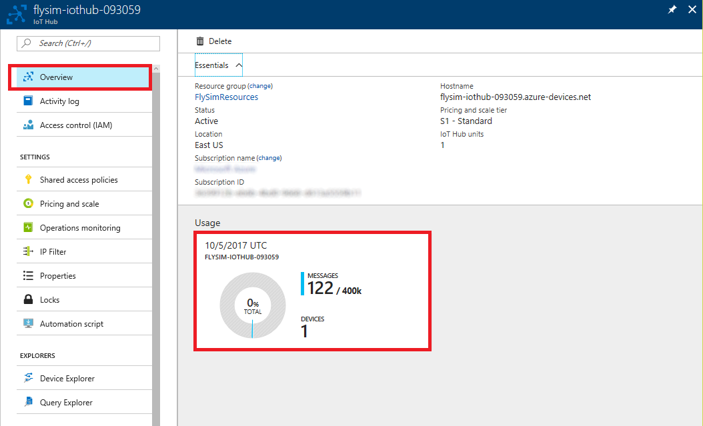

<a name="HOLTitle"></a>
# Connecting an IoT Device to Azure #

---

<a name="Overview"></a>
## Overview ##

Welcome to Cloud City! In this hands-on lab and the ones that follow, you will build a comprehensive IoT solution that demonstrates some of the very best features Microsoft Azure has to offer, including [IoT Hubs](https://azure.microsoft.com/services/iot-hub/), [Event Hubs](https://azure.microsoft.com/services/event-hubs/), [Azure Functions](https://azure.microsoft.com/services/functions/), [Stream Analytics](https://azure.microsoft.com/services/stream-analytics/), and [Cognitive Services](https://azure.microsoft.com/services/cognitive-services/). The solution you build today will culminate with an air-traffic control (ATC) app that shows simulated aircraft flying through an ATC sector and warns users when aircraft get too close to each other.


_The air-traffic control application_

You will be the pilot of one of these aircraft. And to do the flying, you will use hardware provided to you for this event. The [MXChip](https://microsoft.github.io/azure-iot-developer-kit/) is an Arduino-based device that is ideal for prototyping IoT solutions. It features an array of sensors, including an accelerometer, a gyrometer, and temperature and humidity sensors, and it includes built-in WiFi so it can transmit data to Azure IoT Hubs wirelessly. It also features a micro-USB port by which you can connect it to your laptop, upload software, and power the hardware. You will control your aircraft by tilting the MXChip backward and forward to go up and down, and rotating it left and right to turn.


_IoT development board_

Here is how the solution is architected, with elements that you will build or deploy highlighted in light blue:

![A data flow diagram showing IoT information originating from an Azure MXChip flowing through IoT Hub and onto an Azure Function.  From the Azure Function, data is bifercated to flow through a client application, as well as to an Event Hub shared by all workshop participants.  The shared Event Hub forwads data to Azure Stream Analytics, where it is forwarded onto another event hub for distribution to the client application.  Additionally, there are data flows from the client application to Cognitive Services and from Stream Analytics to Cosmos DB](Images/architecture.png)

_Solution architecture_

Accelerometer data from the device is transmitted to an Azure IoT Hub. An Azure Function transforms the raw accelerometer data into *flight data* denoting airspeed, heading, altitude, latitude, longitude, pitch, and roll. The destination for that data is a pair of Event Hubs — one that you set up, and one that is shared by every pilot in the room. Events from the "private" Event Hub are consumed by a client app running on your laptop that shows the position and attitude of your aircraft. The events sent to the shared Event Hub go to a Stream Analytics job that analyzes fast-moving data for aircraft that are in danger of colliding and provides that data to the client app and the ATC app. When your aircraft comes too close to another, it turns red on the screen, and a warning appears on the screen of your MXChip. To top it off, Microsoft Cognitive Services translates the warning into the language of your choice.

The goal of this lab is to get the device up and running and sending events to an Azure IoT Hub. Let's get started!

<a name="Prerequisites"></a>
## Prerequisites ##

The following are required to complete this lab:

- An [MXChip IoT DevKit](https://microsoft.github.io/azure-iot-developer-kit/)
- A computer running [Windows 10 Anniversary Edition](https://www.microsoft.com/en-us/software-download/windows10) or higher
- An active Microsoft Azure subscription. If you don't have one, [sign up for a free trial](http://aka.ms/WATK-FreeTrial)
- An available WiFi connection or mobile hotspot

<a name="Exercises"></a>
## Exercises ##

This lab includes the following exercises:

- [Exercise 1: Power up the device and connect to WiFi](#Exercise1)
- [Exercise 2: Prepare a development environment](#Exercise2)
- [Exercise 3: Provision an Azure IoT Hub](#Exercise3)
- [Exercise 4: Deploy an app to the device](#Exercise4)
- [Exercise 5: Check IoT Hub activity](#Exercise5)
 
Estimated time to complete this lab: **60** minutes.

<a name="Exercise1"></a>
## Exercise 1: Power up the device and connect to WiFi ##

You should have already received a package containing an MXChip IoT DevKit and a USB cable. In this exercise, you will connect the device to your laptop, allow Windows to install drivers for it, and connect the device to WiFi so it can transmit events to an Azure IoT Hub.

1. Connect the micro end of the USB cable to the micro-USB port on the device (1). Then connect the other end of the cable to a USB port on your computer (2). Confirm that the green LED next to the micro-USB port on the board lights up (3), and that "No WiFi" appears on the screen of the device.

	

    _Connecting the device to your laptop_

1. Wait for Windows to install the necessary drivers on your laptop. Then open a File Explorer window and confirm that it shows a new drive named "AZ3166." The drive letter that it is assigned to it may be different on your computer.

	

    _The installed device_

1. Now that the device has power and Windows recognizes it as a USB device, the next step is to get it connected to WiFi. That involves putting the device into access-point (AP) mode so that it acts as a WiFi access point, connecting to it with a browser, and configuring it to connect to the access point in the room. Put the device into AP mode by doing the following:

	- Press and hold the **B button** 
	- With the B button held down, press and release the **Reset button**
	- Release the **B button**
 
	Verify that an SSID and an IP address appear on the device screen. The IP address is the one that you will use to connect to the device from your laptop.

	

    _Putting the device into AP mode_

1. On your laptop, browse the available networks and connect to the access point whose name is shown on the device screen. If you are prompted for a password, **leave the password empty**. If asked whether to allow your computer to be discoverable by other PCs on the network, answer no.

	

    _Using the device as an access point_

1. Open a browser window and type the IP address shown on the device in Step 3 into the address bar.

1. Select the WiFi network set up for the event and enter the password provided by the event facilitator. Then click **Connect**.

	

    _Connecting the device to WiFi_

1. Confirm that the device successfully connects to WiFi. Make note of the IP address it was assigned.

	

    _Results of a successful connection_

1. Confirm that the screen says "WiFi Connected" and displays the IP address shown in the previous step. If it doesn't — or if the IP address flashes by too quickly for you to read — disconnect the board from your laptop and then plug it back in.


	

    _Connected!_

1. Go to https://microsoft.github.io/azure-iot-developer-kit/docs/upgrading/ and follow the instructions there to make sure you are running the latest version of the firmware. The firmware is constantly being improved, and the boards don't always come with the latest version of the firmware installed.

Now that the device is connected to WiFi, it will automatically connect again if it is powered off and back on. If you later decide to connect it to another network, simply repeat Steps 3 through 8 of this exercise.

<a name="Exercise2"></a>
## Exercise 2: Prepare a development environment ##

In order to write code and upload it to the MXChip, you need to set up a development environment that includes Node.js, Yarn, the Azure CLI, Visual Studio Code, the Visual Studio Code extension for Arduino, the Arduino IDE, and other tools. Fortunately, this process has been wrapped up in an installation script that will do everything for you. In this exercise, you will install these tools and set up a development environment.

1. Go to https://microsoft.github.io/azure-iot-developer-kit/docs/get-started/ and follow the instructions in **Step 5: prepare the development environment** to download and install the latest version of the developer kit for the MXChip. The download may take a while because the download size is about 300 MB.
 
1. After the developer kit is installed, unplug the USB cable from your device. Then start Visual Studio Code.

1. Select **About** from Visual Studio Code's **Help** menu and verify that Visual Studio Code 1.17.0 or higher is installed. If it's not, select **Check for Updates...** from the **Help** menu and update to the latest version, or go to https://code.visualstudio.com/ and download the latest version. Then restart Visual Studio Code.

1. Plug the USB cable back into the device. If you are prompted to allow Java traffic through the firewall, click **Allow Access**.
 
1. Use the **View** > **Command Palette** command (or press **Ctrl+Shift+P**) in Visual Studio Code to display the command palette. Then select **Arduino: Board Manager**.

	

    _Launching the Arduino Board Manager_ 

1. Type "AZ3166" into the search box and verify that the latest version of the IoT Developer Kit is installed. If it is not, click the **Select version** button and select the latest version from the list. Then click the **Install** button to update the developer kit. 
 
	

    _Verifying the developer kit version number_

1. Open the command palette again and select **Arduino: Library Manager**. Type "ArduinoJson" into the search box. If the version of the package that's installed isn't the latest version shown in the drop-down list, select the latest version from the list and click **Install** to install it.

	

    _Updating the ArduinoJson library_

1. Open a Command Prompt window and type the following command to determine what version of the Azure CLI is installed:

	```
	az -v
	```

	If the azure-cli version number displayed is lower than 2.0.9, go to https://docs.microsoft.com/en-us/cli/azure/install-azure-cli?view=azure-cli-latest and install the latest version.

1. Type the following command into the Command Prompt window to discard any credentials cached by the Azure CLI:

	```
	az logout
	```

In [Exercise 4](#Exercise4), you will use the development environment you just set up to upload code to the MXChip that transmits data to an Azure IoT Hub. Your next task, however, is to create the IoT Hub.

<a name="Exercise3"></a>
## Exercise 3: Provision an Azure IoT Hub ##

[Azure IoT Hubs](https://docs.microsoft.com/azure/iot-hub/iot-hub-what-is-iot-hub) enable IoT devices to connect securely to the cloud and transmit messages (events) that can be ingested by apps and other Azure services. They support bidirectional communication, and they are built to be massively scalable. A single IoT Hub can handle millions of events per second. Messages can be sent over HTTP, or using the [Advanced Message Queuing Protocol](https://docs.microsoft.com/en-us/azure/iot-hub/iot-hub-what-is-iot-hub) (AMQP) or [Message Queueing Telemetry Transport](https://docs.microsoft.com/en-us/azure/iot-hub/iot-hub-what-is-iot-hub) (MQTT) protocol. Devices can be authenticated using per-device security keys or X.509 certificates.

In this exercise, you will provision an Azure IoT Hub for your MXChip to transmit events to.

1. Open the [Azure Portal](https://portal.azure.com) in your browser. If asked to log in, do so using your Microsoft account.

1. Click **+ New**, followed by **Internet of Things** and **IoT Hub**.

	

    _Provisioning a new IoT Hub_
 
1. Enter a unique name for IoT Hub in the **Name** field. IoT Hub names must be unique across Azure, so make sure a green check mark appears next to it. Also make sure **Create new** is selected under **Resource group**, and enter the resource-group name "FlySimResources." Select **East US** as the **Location** (important!). Accept the default values everywhere else, and then click **Create**.

	> You selected East US as the location because in Lab 3, the instructor will create Azure resources in that same region for the IoT Hub to connect to. Azure resources can be connected across regions, but keeping everything within the same data center reduces cost and minimizes latency.

	

    _Configuring an IoT Hub_
 
1. Click **Resource groups** in the ribbon on the left side of the portal, and then click **FlySimResources** to open the resource group.

	

    _Opening the resource group_

1. Wait until "Deploying" changes to "Succeeded," indicating that the IoT Hub has been provisioned. You can click the **Refresh** button at the top of the blade to refresh the deployment status.

	

    _Successful deployment_

The next step is to get the MXChip transmitting events to the IoT Hub. Remember the name you assigned to the IoT Hub in Step 3, because you will need it in the next exercise.

<a name="Exercise4"></a>
## Exercise 4: Deploy an app to the device ##

In this exercise, you will compile an embedded C++ app that transmits events to your Azure IoT Hub and use Visual Studio Code to upload it to the MXChip. Once the app is uploaded, it will begin executing on the device, and it will send a JSON payload containing three accelerometer values (X, Y, and Z) as well as temperature and humidity readings approximately every two seconds. The app is persisted in the firmware and automatically resumes execution if the device is powered off and back on.

1. Start Visual Studio Code and select **Open Folder...** from the **File** menu. Browse to the "FlySimEmbedded" folder included in the lab download. 

1. Open **config.h** and replace YOUR_DISPLAY_NAME with a friendly display name. Then save the file. **This name will be seen by everyone when the ATC app is run in Lab 4**, so please choose a name that's appropriate. Also make it as **unique as possible** by including birth dates (for example, "Amelia Earhart 093059") or other values that are unlikely to be duplicated.

	

    _Entering a display name_
 
1. Press **F1** and type "terminal" into the search box. Then select "Select Default Shell."

	

    _Selecting the default shell_

1. Select PowerShell from the list of shells to make PowerShell the default shell.

	

    _Making PowerShell the default shell_

1. Select **Run Task** from Visual Studio Code's **Tasks** menu, and then select **cloud-provision** from the drop-down list of tasks. This will begin the process of authorizing your device to access the IoT Hub created in the previous exercise. 

	

    _Starting the cloud-provisioning process_

1. When a "Device Login" screen appears in your browser, copy the login code displayed in Visual Studio Code's Terminal window to the clipboard.

	

    _Getting the device-login code_

1. Return to the "Device Login" screen in the browser, paste the login code into the input field, and click **Continue**.

	

    _Logging in to the device_
	 
1. Return to the Terminal window in Visual Studio Code and wait for a list of Azure subscriptions to appear. Use the up- and down-arrow keys to select the Azure subscription that you used when you provisioned the Azure IoT Hub in Exercise 3. Then press **Enter** to select that subscription.

1. When a list of IoT Hubs associated with the subscription appears in the Terminal window, select the IoT Hub that you provisioned in [Exercise 3](#Exercise3).

	

    _Selecting an Azure IoT Hub_

1. Wait until the message "Terminal will be reused by tasks, press any key to close it" appears in the Terminal window. This indicates that the cloud-provisioning process completed successfully. Your MXChip can now authenticate with the IoT Hub and send messages to it securely.

	

    _A successful cloud-provision task_

1. Select **Tasks** > **Run Task** again, and then select **device-upload**. 

	

    _Starting the device-upload process_

1. Wait until you are prompted in the Terminal window to "hold on Button A and then press Button Reset to enter configuration mode." Then do the following:

	- Press and hold the **A button** on the device 
	- With the A button held down, press and release the **Reset button**
	- Release the **A button**

	After a brief pause, the C++ app that reads accelerometer data and transmits it to the IoT Hub will begin uploading to your device. If you are curious to see what the source code looks like, examine the CPP files in the project directory in Visual Studio Code. 

1. Wait until the message "Terminal will be reused by tasks, press any key to close it" appears in the Terminal window. After the device restarts, confirm that the message "IN FLIGHT" appears on the screen of the device, followed by X, Y, and Z values that change when you tilt the board in any direction. These are the accelerometer values passed to the IoT Hub. The fact that they appear on the screen confirms that the upload was successful and that the app is running on the device.

	

    _MXChip with your embedded code running on it_

We know that the device is transmitting events. Now let's make sure those events are being received by the IoT Hub.

<a name="Exercise5"></a>
## Exercise 5: Check IoT Hub activity ##

In this exercise, you will use the Azure portal to confirm that the MXCHip is registered with the IoT Hub you created in [Exercise 3](#Exercise3), and also confirm that the hub is receiving messages from the device.

1.  Return to the Azure portal and to the "FlySimResources" resource group. Then click the IoT Hub that you created in Exercise 3.

	

    _Opening a blade for the IoT Hub_

1. Click **Device Explorer** to display a list of all devices that are registered to communicate with this IoT Hub. Confirm that your device ("AZ3166") appears in the list.

	

    _Devices registered with the IoT Hub_

1. Click **Overview** and look at the count of messages received and the number of devices registered. Confirm that the device count is 1, and that the number of messages received is greater than zero.

	

    _Stats regarding the IoT Hub_

1. Return to Visual Studio Code and click the **Connect** icon in the status bar at lower right.

	

    _Connecting to the device via a COM port_

1. When the icon changes to an 'X', click the Baud rate just to its left and select **115200** from the drop-down list to increase the Baud rate. 

	

    _Increasing the Baud rate_

1. Look in Visual Studio Code's Output window and confirm that events are being transmitted. You can also see the JSON format in which they're transmitted. This is the raw data streaming to the IoT Hub. Note that the display name you entered in the previous exercise is transmitted in a field named "deviceId," and that each message includes a timestamp in the "timestamp" field.

	

    _Events transmitted from the device to the IoT Hub_

The MXChip is now running embedded code that sends accelerometer data to the IoT Hub. Consumers of that data can examine the X, Y, and Z values and determine the device's physical orientation in space. This sets the stage for the next lab, in which you will make use of that data.

<a name="Summary"></a>
## Summary ##

In this lab, you created an Azure IoT Hub and configured your MXChip to send data to it.

In Lab 2, you will build the infrastructure necessary to fly a simulated aircraft using the MXChip. That infrastructure will consist of an Azure Function that transforms accelerometer readings passing through the IoT Hub into flight data denoting the position and attitude of an aircraft, as well as an Azure Event Hub that receives data from the Azure Function. Once the Function and Event Hub are in place, you will connect a client app to the Event Hub and practice flying an aircraft by tilting your MXChip backward and forward to go up and down and rotating it right and left to bank and turn. In other words, the fun is just beginning!

---

Copyright 2017 Microsoft Corporation. All rights reserved. Except where otherwise noted, these materials are licensed under the terms of the MIT License. You may use them according to the license as is most appropriate for your project. The terms of this license can be found at https://opensource.org/licenses/MIT.